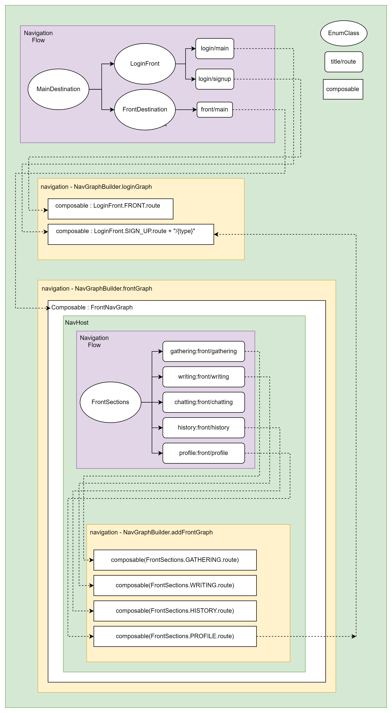
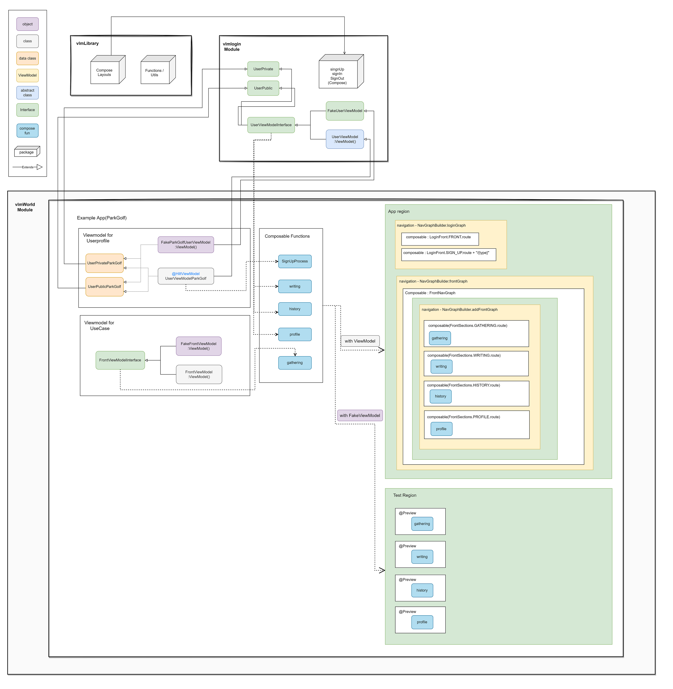
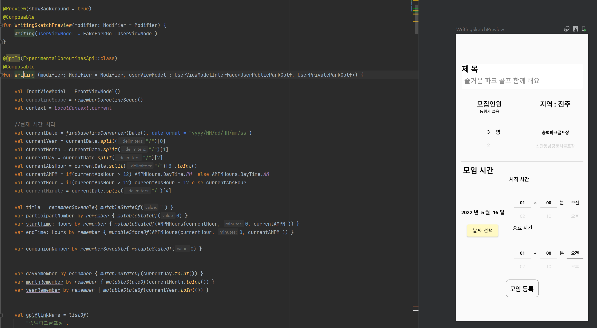

# YoonHyeonJoon's Android Example Structure

<br>

### 1. Navigation Flow

<p align="center">
  
</p>

<h4 align="center"> App(Parkgolf meeting)의 composable navigation Graph </h4>

<br/>

1. navigation Path는 enum class로 구성하여 NavGraphBuilder의 route를 지정하여 해당 composable를 호출하는데 사용합니다.
2. 해당앱은 MainDestination에서 2개의 Composable 인 Login 파트와 FrontDestination 파트로 구분되어 있으며, FrontDestination은 inner navigation을 가지는 하나의 composable로 연결되어 주요 기능을 구성합니다
3. FrontNavGraph의 각 composable들은 하나의 view를 생성하여 bottom Navigation의 각 tab을 구성합니다<br/>

<br>

```kotlin
enum class MainDestination(
    val title: String, //@StringRes val title: Int,
    val route: String
) {
    LOGIN(LoginFront.FRONT.title, LoginFront.FRONT.route),
    FRONT(FrontDestination.FRONT.title, FrontDestination.FRONT.route),
}

enum class LoginFront(
    val title: String, //@StringRes val title: Int,
    val route: String
) {
    FRONT("login", "login/main"),
    SIGN_UP("login", "login/signup"),
}

enum class FrontDestination(
    val title: String,
    val route: String
) {
    FRONT("front", "front/main"),
}

enum class FrontSections(
    @StringRes val title: Int,
    val sectionName: String,
    val icon: ImageVector,
    val route: String
) {
    GATHERING(R.string.home_gathering, "gathering", Icons.Outlined.Search, "front/gathering"),
    WRITING(R.string.home_writing, "writing", Icons.Outlined.Search, "front/writing"),
    CHATTING(R.string.home_chatting, "chatting", Icons.Outlined.Home, "front/chatting"),
    HISTORY(R.string.home_history, "history", Icons.Outlined.ShoppingCart, "front/history"),
    PROFILE(R.string.home_profile,"profile",  Icons.Outlined.AccountCircle, "front/profile")
}
```

<h4 align="center"> graph Enum classes </h4>

<br><br>

```kotlin
 NavHost(
     navController = appStateHolder.navController,
     startDestination =  MainDestination.LOGIN.title,
     modifier = Modifier.padding(it)
 )
 {
     navigation(
         route = MainDestination.LOGIN.title,
         startDestination = MainDestination.LOGIN.route)
     {
         loginGraph(
             signinLibraryViewModel  =  signinLibraryViewModel,
             userViewModel           =  userViewModel,
             signResponse            =  appStateHolder::navigateToSignUp
         )
     }

     navigation(
         route = MainDestination.FRONT.title,
         startDestination = MainDestination.FRONT.route)
     {
         frontGraph(
             signinLibraryViewModel  =  signinLibraryViewModel,
             userViewModel           =  userViewModel,
             frontViewModel          =  frontViewModel,
             signResponse      =  appStateHolder::navigateToSignUp
         )
     }
 }
```

<h4 align="center"> composable navigation structure (MainDestination)  </h4>

<br/><br>

```kotlin
 NavHost(
     navController = navController,
     startDestination = startDestination,
     modifier = modifier
 ) {
     navigation(
         route = FrontSections.GATHERING.sectionName,
         startDestination = FrontSections.GATHERING.route
     ) {
         addFrontGraph(
             modifier = modifier,
             userViewModel = userViewModel,
             frontViewModel = frontViewModel,
             signResponse = signResponse
         )
     }
 }
```

<h4 align="center"> composable navigation structure (Front) </h4>

<br/><br><br/>

### 2. App Data 구조

#### 1. Data Structure Flow

<p align="center">
  
</p>

<h4 align="center"> App structure Data Flow </h4>

<br/>
<br/>

1. User Account Information에 대한 High abstract level 정의는 **vlmlogin package**에서 구성하고, 이를 app 개발을 위한 Module에서 implementation하여 low level을 구현 합니다.
2. 또한, **vlmlogin package**는 Sign-in, Sign-out, Sign-up에 대한 process이 고수준으로 구현되어있고 이를 활용할 수 있습니다.
3. 해당 앱은 user data를 private와 public으로 나누어 관리하며, Db에 저장될 때 [public/priavte/..] 의 형태로 공개될 데이터와 비공개될 데이터를 나누어 관리할 수 있도록 구성되어있습니다.
4. 이 두 Interface를 요소를 Generic하게 받아 UserViewmodel Interface를 구성합니다. 이를 상속받은 Fake Viewmodel과 Real Viewmodel를 만들기 위한 Interface / abstract로 나누어 관리합니다. Fake VidewModel에 Test Code를 삽입하거나 Compose Preview 구성 등으로 사용할 수 있습니다.
5. ViewModel을 사용하는 Compose function은 고수준의 Interface를 Argument로 받기 때문에 Fake와 Real Viewmodel 모두를 사용 목적에 따라 사용할 수 있게됩니다.
6. **vlmLibrary package는** 개발에 필요한 utils과 layouts, 그리고 methods들을 구현해놓은 package이며, 반복적으로 사용될 compose를 구현해놓은 package입니다.

<br/>

#### 2. 코드 구성 예

<br/>

##### Login Module Data

<br/>

1. Data Interface Part

```kotlin
interface UserPublic {
   var fid : String
   var eid : String
   var gender : Int
}

interface UserPrivate {
   var fid : String
   var eid : String
}
```

<br>

2. ViewModel Part

```kotlin
interface UserViewModelInterface<userPublic:UserPublic, userPrivate : UserPrivate>
{
    var userFid : String
    var userBasicData : MutableLiveData<userPublic>
}

interface FakeUserViewModel <userPublic : UserPublic, userPrivate : UserPrivate> : UserViewModelInterface<userPublic, userPrivate>
{
    override var userFid: String //= "fakeFid"
    override var userBasicData: MutableLiveData<userPublic> //= MutableLiveData<userPublicGeneric>()
}

abstract class UserViewModel<userPublic:UserPublic, userPrivate:UserPrivate>
: ViewModel() , UserViewModelInterface<userPublic, userPrivate>
{
   override var userFid = ""
   open var userEid = ""
   open var passwordContainer = "" //이 변수가 카카오 구글 페이스북 중에 선택한 아이디를 기억한다

   open var userProfileThumbNailPath = mutableListOf<String>() // 내 사진 사용할때!!

   override var userBasicData =  MutableLiveData<userPublic>()
   open fun setUserBasicData (value : userPublic){
   
   }
   //... and so on
}
```

<br>

3. App Data Part

```kotlin
//public
data class UserPublicParkGolf(

   override var fid : String = "",
   override var eid: String = "",
   override var gender: Int = 0,
   
   var certificationPhone : Int = 2,
   var hobby: String = "",
   var job: String = "",
   var affiliate : String = "" //소속
    // .. and so on

) : UserPublic

//private
data class UserPrivateParkGolf(
   
   override var fid                    : String = "",
   override var eid                    : String = "",
   
   var account_confirm                 : Boolean = false,
   var accuracy                        : Double  = 0.0,
   var altitude                        : Double  = 0.0,
   var latitude                        : Double  = 0.0,
   var longitude                       : Double  = 0.0,
   var name                            : String  = "",
   var notifyingAll                    : Boolean = true,
   var notifyingOptionMasterMsg        : Boolean = true,
   var notifyingTodayCard              : Boolean = true,
   var notifyingReceiveCard            : Boolean = true,
   var notifyingMessaging              : Boolean = true,
   var notifyingMapPostingParticipant  : Boolean = true,
   var storePoint                      : Int     = 0,
   var userBlocked                     : Boolean = false
    // .. and so on
) : UserPrivate
```

<br>

4. App ViewModel Part

```kotlin
//real Viewmodel
@HiltViewModel
class UserViewModelParkGolf
@Inject constructor() : UserViewModel<UserPublicParkGolf, UserPrivateParkGolf>() {

    override var userFid = ""
    override var userEid = ""

    //... and so on
}
//Fake Viewmodel
object FakeParkGolfUserViewModel : FakeUserViewModel<UserPublicParkGolf, UserPrivateParkGolf> {
    override var userFid: String = "fakeFid"
    override var userBasicData: MutableLiveData<UserPublicParkGolf> = MutableLiveData<UserPublicParkGolf>()
    // .. and so on
}
```

<br>

5. Usage Example

```kotlin
@Composable
fun Writing (modifier: Modifier = Modifier, userViewModel : UserViewModelInterface<UserPublicParkGolf, UserPrivateParkGolf>)
{
    // .. and so on
}

/**Fake ViewModel for Preview**/
@Preview(showBackground = true)
@Composable
fun WritingSketchPreview(modifier: Modifier = Modifier) {
    Writing(userViewModel = FakeParkGolfUserViewModel)
}

/**Real ViewModel**/
//private val userViewModel : UserViewModelParkGolf by viewModels() // from Activity
//...
    Writing(userViewModel = userViewModel)
//...

```

<br><br>

<p align="center">

</p>

<h4 align="center"> FakeViewmodel을 사용하여 Writing의 Preview를 확인하는 예제 </h4>

<br>
<br>

위와 같이 App 개발 시 Clean Architecture를 적용하여 Extensible/Reusable한 설계를 구성하였습니다.


